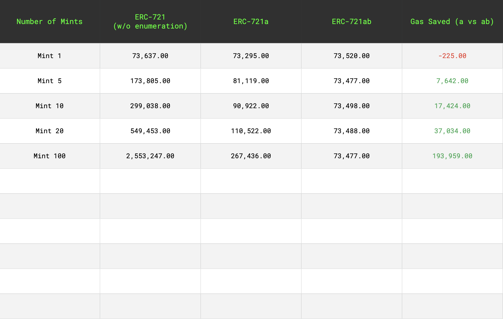

## About The Project

Forked https://github.com/chiru-labs/ERC721A to display gas savings when including the [ERC-2309](https://eips.ethereum.org/EIPS/eip-2309) consecutive transfer extension. By utilizing ERC-2309 we can acheive a truly constant gas price for minting 1 or 1 million NFTs.

As shown below, a negligible amount of gas is saved when minting 1 NFT, but when minting multiple NFTs the gas savings are tremendous and only increase as we scale up.

The pitfall of minting many NFTs at once using the standard ERC-721 spec is the `Transfer` event. There is no way around using a loop to emit the event for as many NFTs that were minted. The more NFTs that are minted the more costly it becomes. Using the `ConsecutiveTransfer` event specified in ERC-2309 we can mint as many NFTs as we want using O(1) complexity rather than O(n).

